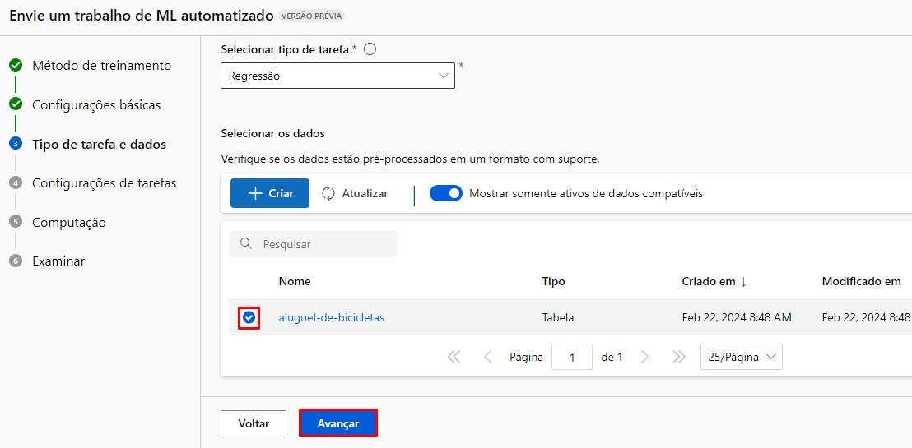

# Modelo de Previsão com Pontos de Extremidade

1. Acesse a página inicial da azure no link: https://portal.azure.com, e clique em "Criar um recurso".

 

2. No menu de opções na lateral esquerda, clique em "Análises".

 

3. Na opção "Azure Machine Learning" clique em "Criar".

 

4. Em "Detalhes do projeto", não altere a opção de assinatura. Em "Grupo de recursos" escolha um já criado ou crie um novo no botão abaixo "Criar novo".

 

5. Descendo a tela, temos "Detalhes do workspace", em "Nome" coloque um nome de sua preferência. É recomendado não utilizar servidores da região do Brasil, por questões de instabilidade, aqui utilize a já indicada pela Azure ou "East US". Os campos "Conta de armazenamento", "Cofre de chaves" e "Application Insights" são preenchidos automáticamente, deixe o campo "Registro de contêiner" como "Nenhum" e clique em "Examinar + criar" na lateral inferior esquerda.  

 

6. Você será redirecionado a outra página com os termos, clique em "Criar" na lateral inferior esquerda.

 

7. Após ser redirecionado, deve aparecer um card de exito. Após isso clique em "Ir para o recurso".

 

8. Na tela inicial do Workspace, clique em "Iniciar o estúdio". Talvez seja necessário refazer o login.

 

9. Ao ser redirecionado, pode ser que seja necessário confirmar algumas informações. Preencha tudo, acesse a tela do workspace criado e clique em "ML automatizado".

 

10. Clique em "Novo trabalho de ML automatizado".

 

11. Na seção "Configurações básicas", preencha o campo "Nome do trabalho" com o nome que será usado para identificar seu projeto. Em "Novo nome do experimento" também preencha com um nome de sua escolha. "Descrição" é opcional e por fim clique em "Avançar".

 

12. Na seção "Tipo de tarefa e dados", selecione a opção "Regressão" para o campo "Selecionar o tipo de tarefa" e em "Selecionar os dados" clique em "Criar".

 

13. Teremos uma nova tela para configurar os dados. Dê um nome para o ativo, o campo descrição é opcional e selecione o tipo como "Tabular", depois clique em "Avançar".

 

14. Na seção "Fonte de dados", selecione a opção "De arquivos da Web" e clique em "Avançar".

 

15. Na seção "URL da Web", indique a URL dos seus dados e clique em "Avançar".

 

16. Configure sua base de dados e clique em "Avançar".

 

17. O esquema varia de acordo com a base de dados, então revise se está tudo correto e clique em "Avançar".

 

18. Revise tudo uma última vez e clique em "Criar".

 

19. Voltando a seção "Tipo de tarefa e dados" selecione a base de dados criada no checkbox ao lado do nome dela e clique em "Avançar".

 

20. Na seção "Configurações de tarefas" selecione a coluna de destino para o seu projeto e clique em "Exibir definições de configuração adicionais".

 

21. Desmarque as opções selecionadas, em "Modelos permitidos" escolha as opções "RandomForest" e "LightGBM" e clique em "Salvar".

 

22. Voltando a seção, nas configurações de "Limite", ajuste conforme seu projeto e marque a checkbox "Habilitar encerramento antecipado".

 

23. Em "Validar e testar" selecione "Divisão de validação de treinamento" no campo "Tipo de validação" e certifique-se que ele setou um valor para a validação no campo abaixo. Depois clique em "Avançar".

 

24. Na seção "Computação" configure conforme o desejado e clique em "Avançar".

 

25. Na seção "Examinar", revise tudo e clique em "Enviar trabalho de treinamento".

 

26. Seu modelo estará pronto para ser usado.

 